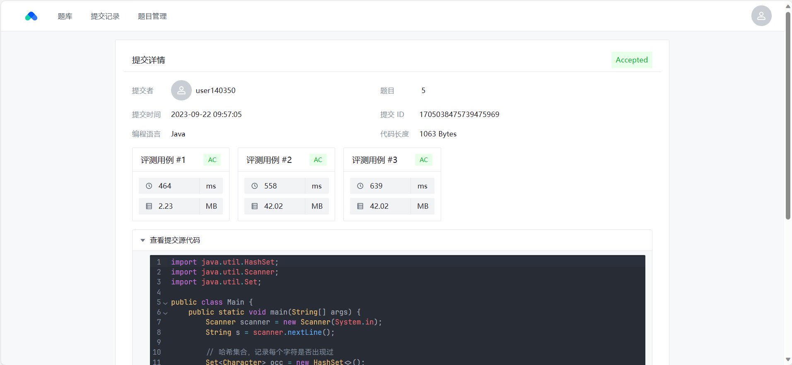
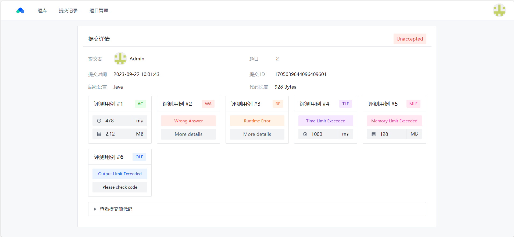

# MOJ - 莫莫在线评测系统 (前端)

## 📝 项目介绍

MOJ 是一个在线评测系统, 旨在为用户提供简单易用的评测服务

在 MOJ, 用户可以轻松注册账户，浏览各种算法题目, 并能够贡献自己编写的题目

此外, 用户还可以查看每次提交的详细评测信息, 从而帮助用户理解和改进自己的编程技巧

MOJ 致力于为广大用户提供高效的编程评测和算法学习体验, 为编程爱好者提供一个交流的平台

> 本仓库为该项目的前端部分, 后端部分请移步 [MOJ-backend](https://github.com/DXMY-Fs/MOJ-backend)

## 🔧 项目技术栈

- Vue.js
- TypeScript
- ArcoDesign
- Vite
- VueRouter
- Pinia
- Axios
- [mavonEditor](https://github.com/hinesboy/mavonEditor) (Markdown 编辑器 / 预览器)
- [codemirror](https://github.com/surmon-china/vue-codemirror) (代码编辑器)

## ✨ 技术亮点

1. 基于 Vue + Arco Design 组件库, 自主实现了题目查看和管理 / 在线做题 / 提交列表等页面
2. 使用 TypeScript + ESLint + Prettier, 保证项目编码和提交规范, 提高代码质量
3. 基于 Vue Router 的路由配置文件自动生成导航菜单, 并通过权限配置实现菜单的动态显隐
4. 使用 Pinia 实现全局状态管理, 并通过 `useUserStore` 等自定义函数实现了状态的模块化管理
5. 整合 `mavonEditor` 和 `codemirror` 等开源组件实现了 Markdown 文本编辑器和代码编辑器
6. 开发了全局页面布局和前端项目通用模板, 便于后续开发复用

## 🔍 页面展示

